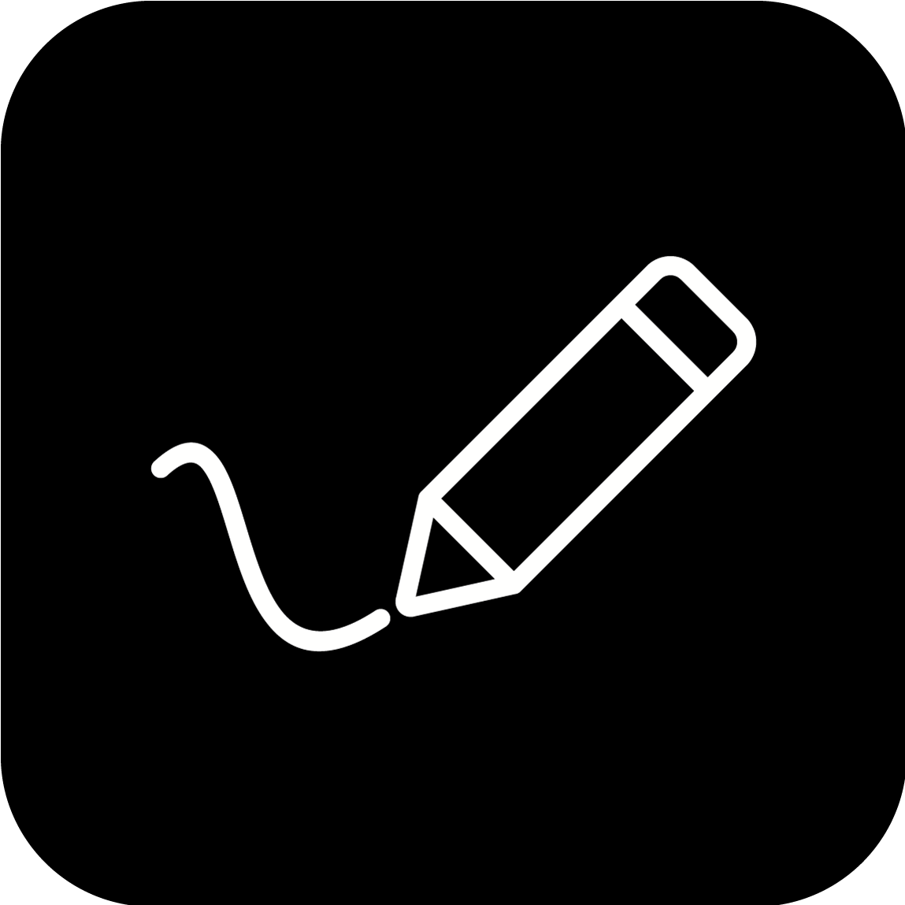
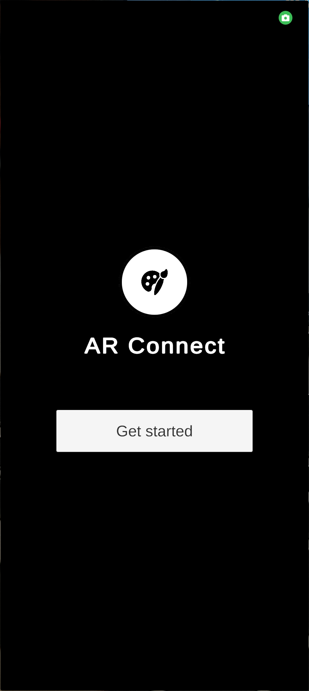
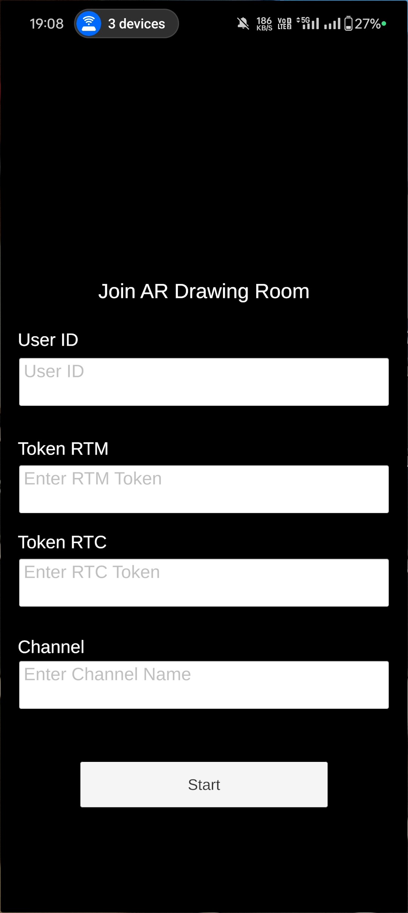
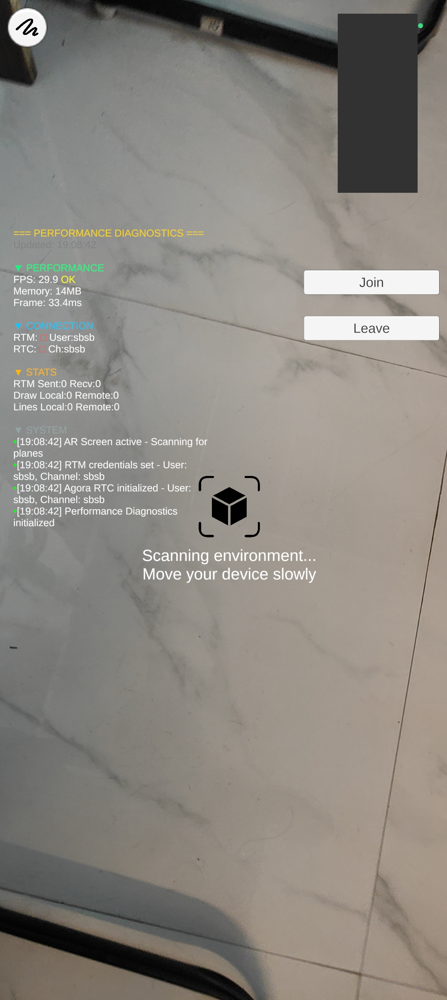
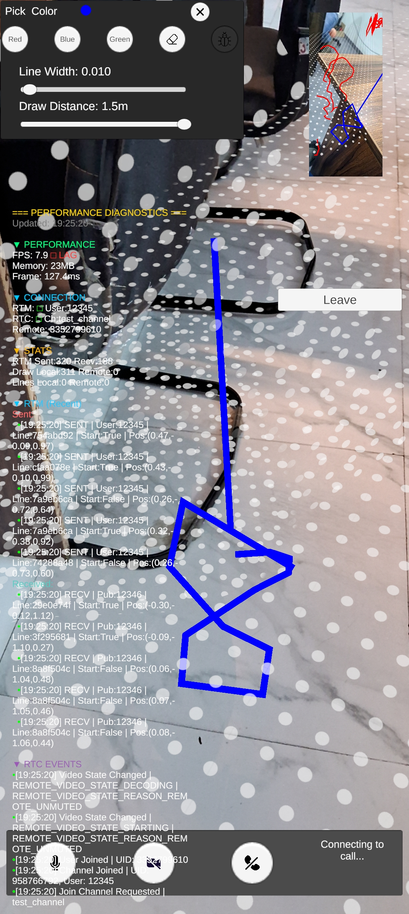

# AR Collaborative Drawing App 🎨✨

A real-time collaborative augmented reality drawing application built with Unity and Agora SDK. Draw in 3D space and see your creations synchronized across multiple devices in real-time!



## 📋 Table of Contents

- [Features](#features)
- [Screenshots](#screenshots)
- [Requirements](#requirements)
- [Installation](#installation)
- [Configuration](#configuration)
- [Usage](#usage)
- [Architecture](#architecture)
- [Troubleshooting](#troubleshooting)
- [License](#license)

---

## ✨ Features

### Core Functionality

- **Real-time AR Drawing**: Draw 3D lines in augmented reality space
- **Multi-user Collaboration**: See other users' drawings in real-time
- **Video Calling**: Built-in video call functionality with screen sharing
- **Color Selection**: Choose from multiple drawing colors (Red, Blue, Green)
- **Adjustable Settings**:
  - Line width control (0.005m - 0.05m)
  - Drawing distance adjustment (0.5m - 3.0m)
- **Clear All**: Remove all drawings with one tap
- **Performance Monitoring**: Built-in diagnostics panel for debugging

### Technical Features

- AR plane detection and tracking
- Real-time message synchronization via Agora RTM
- Video streaming via Agora RTC
- Optimized frame capture and rendering
- Cross-platform support (iOS/Android)

---

## 📸 Screenshots

### 1. Splash Screen


_Initial loading screen with app branding_

### 2. Login & Configuration


_Enter user credentials, channel name, and optional tokens_

### 3. AR Scanning


_Scanning environment for plane detection_

### 4. Drawing Interface


_Main AR drawing interface with color panel and controls_

### 5. Collaborative Session


_Multiple users drawing together in real-time_

### 6. Performance Diagnostics


_Performance metrics and connection status monitoring_

---

## 🔧 Requirements

### Software

- **Unity**: 2021.3 LTS or higher
- **Unity Packages**:
  - AR Foundation 5.0+
  - ARCore XR Plugin (Android)
  - ARKit XR Plugin (iOS)
  - TextMeshPro
- **Agora SDK**:
  - Agora RTC SDK 4.x
  - Agora RTM SDK 2.x

### Hardware

- **iOS**: iPhone 6S or newer with iOS 12+
- **Android**: ARCore compatible device with Android 7.0+
- Minimum 2GB RAM
- Camera access required

### Agora Account

- Sign up at [Agora.io](https://www.agora.io)
- Create a project
- Get your App ID
- (Optional) Generate RTC and RTM tokens for production

---

## 📦 Installation

### 1. Clone the Repository

```bash
git clone https://github.com/yourusername/ar-collaborative-drawing.git
cd ar-collaborative-drawing
```

### 2. Open in Unity

1. Open Unity Hub
2. Click "Add" and select the project folder
3. Open the project with Unity 2021.3 LTS or higher

### 3. Import Agora SDK

1. Download Agora Video SDK from [Agora Downloads](https://docs.agora.io/en/sdks)
2. Download Agora RTM SDK
3. Import both SDKs into Unity:
   - `Assets → Import Package → Custom Package`
   - Select downloaded `.unitypackage` files

### 4. Install Required Packages

Open Package Manager (`Window → Package Manager`) and install:

- AR Foundation
- ARCore XR Plugin (for Android)
- ARKit XR Plugin (for iOS)
- TextMeshPro (if not already installed)

---

## ⚙️ Configuration

### 1. Set Up Agora Credentials

#### AgoraManager.cs

```csharp
[SerializeField] private string appID = "YOUR_AGORA_APP_ID";
```

#### AgoraRTMSimpleTest.cs

```csharp
[SerializeField] private string appId = "YOUR_AGORA_APP_ID";
```

### 2. Configure Build Settings

#### For iOS:

1. `File → Build Settings → iOS`
2. Click "Player Settings"
3. Set:
   - **Bundle Identifier**: com.yourcompany.ardrawing
   - **Camera Usage Description**: "Required for AR drawing"
   - **Architecture**: ARM64
4. Add to `Info.plist`:

```xml
<key>NSCameraUsageDescription</key>
<string>Camera access for AR drawing</string>
<key>NSMicrophoneUsageDescription</key>
<string>Microphone access for voice calls</string>
```

#### For Android:

1. `File → Build Settings → Android`
2. Click "Player Settings"
3. Set:
   - **Package Name**: com.yourcompany.ardrawing
   - **Minimum API Level**: Android 7.0 (API 24)
   - **Target API Level**: Android 13 (API 33) or higher
4. Enable:
   - **ARCore Supported** (XR Settings)
   - **Internet Access**
   - **Camera Permission**
   - **Microphone Permission**

---

## 🚀 Usage

### Starting a Session

1. **Launch the App**

   - Wait for the splash screen to load

2. **Enter Credentials**

   - **User ID**: Choose a unique username
   - **Channel Name**: Enter a channel name (others must use the same name to join)
   - **RTC Token** (Optional): For production use
   - **RTM Token** (Optional): For production use
   - Click **"Start"**

3. **Scan Environment**

   - Move your device to scan horizontal surfaces
   - Wait for "Tracking active" message

4. **Join Call**

   - Click **"Join Call"** button
   - Wait for connection confirmation

5. **Start Drawing**
   - Tap/drag on screen to draw
   - Use color panel to change settings
   - View remote users' drawings in real-time

### Drawing Controls

#### Color Panel

- **Toggle Button**: Opens/closes color selection panel
- **Color Buttons**: Red, Blue, Green
- **Line Width Slider**: Adjust thickness (0.005 - 0.05m)
- **Draw Distance Slider**: Change drawing distance from camera (0.5 - 3.0m)
- **Clear Button**: Remove all drawings (synced across users)

#### Call Controls

- **Mute Audio**: Toggle microphone on/off
- **Mute Video**: Toggle video streaming on/off
- **Leave Call**: Exit the session

#### Debug Panel

- **Toggle Debug**: Show/hide performance diagnostics
- **Keyboard Shortcut**: F12 or Backtick (`)

---

## 🏗️ Architecture

### Core Components

#### 1. **ARDrawingManager**

- Handles AR drawing logic
- Manages local and remote line renderers
- Synchronizes drawing data via RTM
- Plane detection and tracking

#### 2. **AgoraManager**

- RTC engine initialization
- Channel management (join/leave)
- Audio/video control
- Event handling

#### 3. **AgoraRTMSimpleTest**

- RTM client management
- Message publishing/subscribing
- Drawing data serialization
- Clear command handling

#### 4. **ARScreenShareManager**

- AR camera frame capture
- Video frame encoding
- Remote video rendering
- Performance optimization

#### 5. **UIFlowManager**

- Screen navigation
- User input handling
- UI state management
- Credential management

#### 6. **PerformanceDiagnostics**

- Real-time performance monitoring
- Network statistics
- Debug logging
- Export functionality

### Data Flow

```
User Drawing → ARDrawingManager → RTM Message → Remote Users
                                ↓
                         Local Rendering
```

```
AR Camera → Frame Capture → Video Encoding → RTC → Remote Display
```

### Message Format

#### Drawing Data

```json
{
  "lineId": "unique-guid",
  "pX": 1.5,
  "pY": 0.5,
  "pZ": 2.0,
  "cR": 1.0,
  "cG": 0.0,
  "cB": 0.0,
  "isStart": true,
  "publisherId": "user123"
}
```

#### Clear Command

```json
{
  "command": "CLEAR_ALL",
  "publisherId": "user123",
  "timestamp": 638367840000000000
}
```

---

## 🐛 Troubleshooting

### Common Issues

#### 1. **"Plane tracking not working"**

**Solution:**

- Ensure good lighting conditions
- Point camera at textured surfaces
- Move device slowly
- Check AR permissions in device settings

#### 2. **"Cannot connect to channel"**

**Solution:**

- Verify App ID is correct
- Check internet connection
- Ensure firewall allows Agora connections
- Try regenerating tokens (if using token authentication)

#### 3. **"Remote user not visible"**

**Solution:**

- Confirm both users are in the same channel
- Check video mute status
- Verify RTC initialization
- Review debug panel for connection errors

#### 4. **"Drawings not syncing"**

**Solution:**

- Check RTM login status in debug panel
- Verify channel subscription
- Ensure both devices use same channel name
- Check for RTM message failures in diagnostics

#### 5. **"Poor performance / lag"**

**Solution:**

- Reduce line width
- Lower capture frame rate (in ARScreenShareManager)
- Disable diagnostics panel during use
- Close other apps running in background
- Reduce video bitrate in AgoraManager

### Debug Panel Information

Enable debug panel (F12 or Debug button) to view:

- **FPS**: Current frame rate
- **Memory**: App memory usage
- **RTM Status**: Connection and message statistics
- **RTC Status**: Channel and video state
- **Drawing Stats**: Points and lines count

---

## 📝 Best Practices

### For Developers

1. **Token Security**

   - Never commit tokens to version control
   - Use environment variables or secure storage
   - Implement server-side token generation for production

2. **Performance Optimization**

   - Test on target devices early
   - Monitor frame rate during drawing
   - Optimize line point density
   - Use object pooling for frequently created objects

3. **Error Handling**
   - Always check for null references
   - Implement proper error callbacks
   - Log errors with context information
   - Gracefully handle network failures

### For Users

1. **Network Requirements**

   - Use stable WiFi or 4G/5G connection
   - Minimum 2 Mbps upload/download speed
   - Low latency preferred (<100ms)

2. **Environment Setup**

   - Good lighting (avoid direct sunlight)
   - Textured surfaces for tracking
   - Stable camera movement
   - Clear space for drawing

3. **Drawing Tips**
   - Start with larger line widths
   - Draw at comfortable distance (1-2m)
   - Use contrasting colors
   - Clear drawings periodically for performance

---

## 🔐 Security Considerations

### Production Deployment

1. **Enable Token Authentication**

   - Generate tokens server-side
   - Set appropriate expiration times
   - Implement token refresh mechanism

2. **Channel Access Control**

   - Implement user authentication
   - Validate channel permissions
   - Rate limit channel creation

3. **Data Privacy**
   - Encrypt sensitive data
   - Implement GDPR compliance
   - Handle user data according to privacy policy

---

## 📚 Resources

### Documentation

- [Agora RTC Documentation](https://docs.agora.io/en/video-calling/overview/product-overview)
- [Agora RTM Documentation](https://docs.agora.io/en/real-time-messaging/overview/product-overview)
- [Unity AR Foundation](https://docs.unity3d.com/Packages/com.unity.xr.arfoundation@5.0/manual/index.html)

### Support

- [Agora Developer Community](https://www.agora.io/en/community/)
- [Unity Forums](https://forum.unity.com/)
- [GitHub Issues](https://github.com/yourusername/ar-collaborative-drawing/issues)

---

## 🤝 Contributing

Contributions are welcome! Please follow these steps:

1. Fork the repository
2. Create a feature branch (`git checkout -b feature/AmazingFeature`)
3. Commit your changes (`git commit -m 'Add some AmazingFeature'`)
4. Push to the branch (`git push origin feature/AmazingFeature`)
5. Open a Pull Request

---

## 📄 License

This project is licensed under the MIT License - see the [LICENSE](LICENSE) file for details.

---

## 👥 Authors

- **Your Name** - _Initial work_ - [YourGitHub](https://github.com/yourusername)

---

## 🙏 Acknowledgments

- Agora.io for their excellent SDKs
- Unity Technologies for AR Foundation
- The open-source community for inspiration and support

---

## 📞 Contact

- **Email**: your.email@example.com
- **Project Link**: [https://github.com/yourusername/ar-collaborative-drawing](https://github.com/yourusername/ar-collaborative-drawing)
- **Website**: [https://yourwebsite.com](https://yourwebsite.com)

---

## 🗺️ Roadmap

### Upcoming Features

- [ ] More drawing colors and custom color picker
- [ ] Eraser tool
- [ ] Undo/Redo functionality
- [ ] Save and load drawings
- [ ] 3D shape tools (sphere, cube, cylinder)
- [ ] Text annotations
- [ ] Drawing layers
- [ ] User presence indicators
- [ ] Voice commands
- [ ] Recording and playback

### Known Issues

- Line rendering may flicker on some Android devices
- Video streaming requires optimization for low-end devices
- Token refresh not implemented

---

**Built with ❤️ using Unity and Agora SDK**
